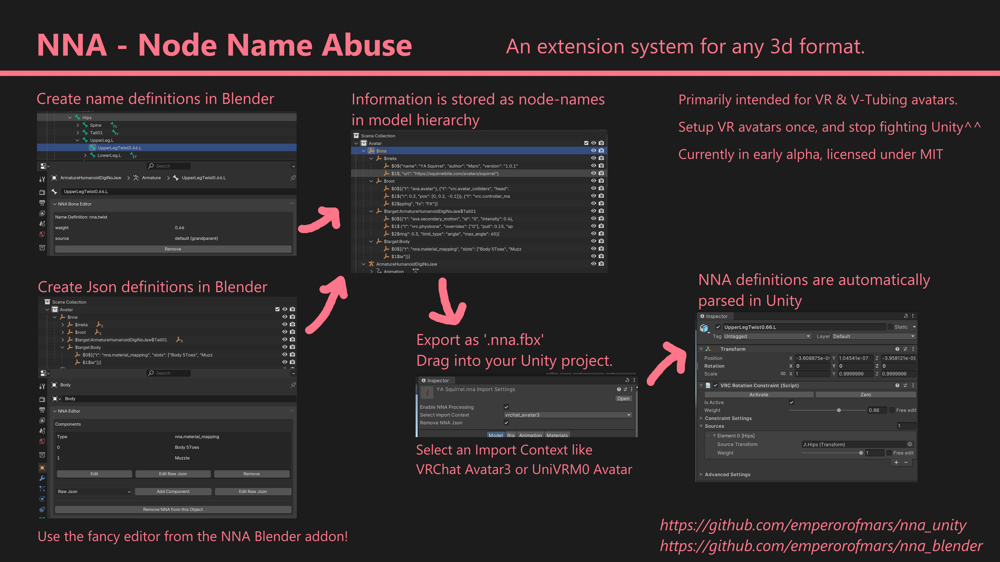

# ⛧ NNA - Blender Tooling ⛧
**Extend any 3d format by abusing node-names to store data!**

It works by serializing data into node-names in the scene hierarchy.\
This is about as heretical as it sounds, but it works, very well.

**Early in development version, do not use productively!**
**[Download the latest release](https://github.com/emperorofmars/nna_blender/releases/latest)**\
Install it in Blender as a new extension from disk:\
Under `Edit` → `Preferences` → `Get Extensions` find the upper right drop-down menu and press `Install from disk`.

Find the Unity counterpart here: <https://github.com/emperorofmars/nna_unity>

---

**[Full Documentation](https://github.com/emperorofmars/nna)** - [Roadmap](https://github.com/emperorofmars/nna/blob/master/roadmap.md)

Issues, discussions & PRs welcome!

⭐ Star this repo if you love heresy! ⭐

---

# License
This repository is licensed under **MIT**.

<!--
	Command to build the extension with a default Windows Blender installation:
	Change the Blender version in the path accordingly.
	C:\'Program Files'\'Blender Foundation'\'Blender 4.2'\blender.exe --command extension build
-->
