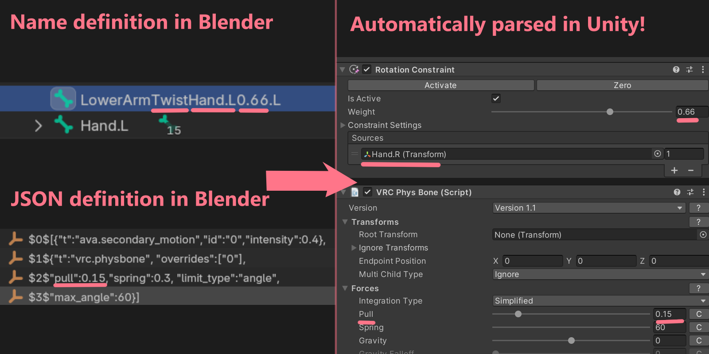
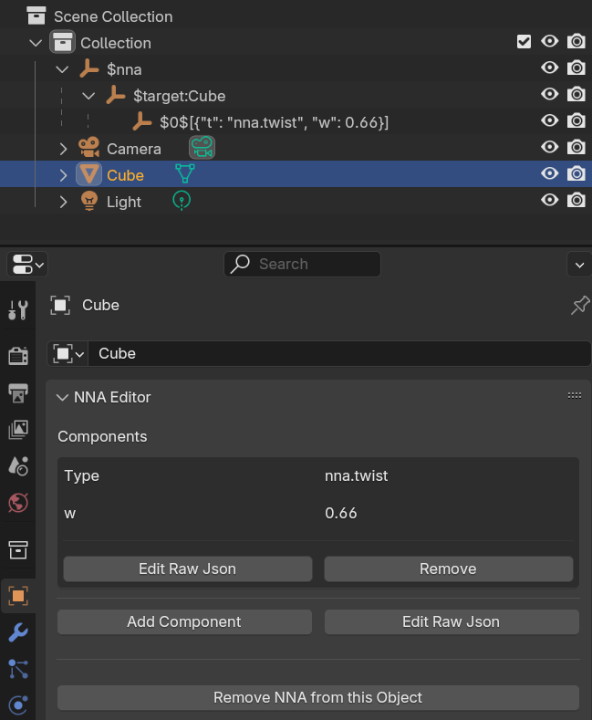

# ⛧ NNA - Node Name Abuse ⛧ | Blender 4.2+ Implementation

**Find the Unity counterpart here: <https://github.com/emperorofmars/nna-unity>**

Extend any 3d format by abusing node-names.\
This works by naming nodes in a specific way, and by serializing JSON into node-names.

This project is an abomination and the sooner it can burn in a fire, the better.

⭐ Star this repo if you love heresy! ⭐

Issues, discussions & PRs Welcome!

## Why
Existing 3d interchange formats are bad. The least horrible one, FBX, is not extensible.

This is a way to add additional information to 3d models in any format, primarily FBX.
Use this Blender Addon to create and edit NNA JSON definitions.

### Goals
* A 3d file should be a self-contained single source of truth for all its functionality, and work across different game engines.
* Artists without too much technical knowledge beyond 3d modeling, should have an easy time creating VR avatars.
* End users without too much technical knowledge, should be able to easily adapt and upload their avatars.

## How
For simpler definitions, information can be encoded into a node name directly.\
For more complex components, you can serialize JSON into an array of child-nodes. This addon will help you work with that.

On import into a game-engine with an NNA implementation, these definitions will be parsed into the game-engines own constructs.

<!--
TODO: write one proper source of truth spec for available components across all nna implementations.
**[Documantation on all provided NNA processors!](Docs/Processors.md)**

You can easily implement additional processors yourself!
-->

## Todo
* NNA JSON definition: object name collision handling
* Name definition tooling
* Perhaps the ability to serialize JSON components to the node directly. Will be annoying for bones.
